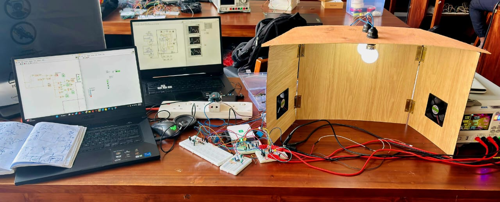
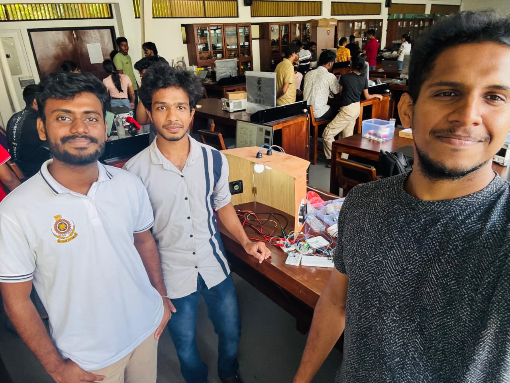

# 🌿 Smart Study Room
**Smart Comfort System – Personalized Study & Workspaces** 📚💡  
*Apr 2025 – Jul 2025 | University of Moratuwa*

A **cost-effective smart system** designed to enhance focus and comfort in personal workspaces. By automatically adjusting **lighting, temperature, and incorporating Active Noise Cancellation (ANC)**, the system creates an ideal environment for studying or working without distractions.

---

## ✨ Main Features

### 🌞 Dynamic Lighting Adjustment
- Ambient light sensor detects brightness and automatically modulates LED lighting.
- Ensures **optimal eye comfort** while saving energy.
- Real-time signal processing with **NI DAQ & LabVIEW**.

### 🌡️ Intelligent Temperature Monitoring
- Workspace conditions tracked using a **resistor-based sensing circuit**.
- **Op-Amp amplifier** converts resistance changes into measurable voltage:  
  `Vout = Vin × (1 + R1/R2)`
- Automates fan operation for a **comfortable environment**.

### 🔊 Active Noise Cancellation (ANC)
- Basic ANC system implemented in **LabVIEW using NI DAQ**.
- **Key Functions:**
  - **Preamplification:** Strengthens audio signal captured by microphone.
  - **Signal Delay:** Aligns electrical signal with incoming noise wave.
  - **Signal Inversion:** Generates an inverted noise signal to cancel unwanted sound.
  - **Filtering:** Isolates noise for more accurate cancellation.
- Reduces ambient noise, creating a **focused study/work environment**.

### 🖥️ Real-Time Automation
- NI DAQ and LabVIEW acquire and process sensor and audio signals.
- Actuators (LEDs, Fan, ANC output) respond instantly to environmental changes.
- Fully **adaptive and user-friendly workspace**.

---

## 🛠️ Tech Stack

- **Hardware:** NI DAQ, Op-Amps, Resistors, LED Lighting, Fan, Microphone & Speaker
- **Software:** LabVIEW
- **Core Skills:** LabVIEW Programming, Control Systems, Real-Time Data Acquisition, Sensor–Actuator Integration, Analog Signal Conditioning, Digital Signal Processing

---

## 🎓 Skills & Learning

- Real-Time Data Acquisition & Processing
- Sensor & Actuator Integration
- Analog Signal Conditioning with Op-Amps
- Active Noise Cancellation & DSP
- Automated Control System Design
- Energy-Efficient Workspace Implementation

---

## 🏁 Impact

- Transforms ordinary study/workspaces into **personalized, productive environments**.
- Reduces eye strain with adaptive lighting.
- Maintains comfort with automated temperature control.
- Minimizes noise distractions with ANC for **better focus and concentration**.
- Demonstrates integration of **analog circuits, digital control, and DSP techniques** in a practical project.

---

## 📷 Visual Highlights

### Prototype
 

### Team Photos
 

## 👩‍🔬 Team Members

- Anjana G.H.C.
- Arththikan S.
- Athukorala H.N.

---

## 🔖 Keywords

#SmartWorkspace #Automation #LabVIEW #DAQ #AnalogCircuits #ControlSystems #ActiveNoiseCancellation #DSP #EnergyEfficiency #StudentProject
